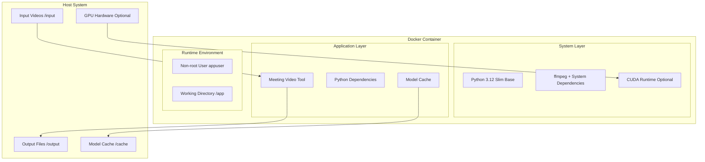

# Design Document

## Overview

This design document outlines the containerization strategy for the Meeting Video Chapter Tool using Docker. The solution will create a production-ready Docker image that packages the Python application, system dependencies (ffmpeg), and supports both CPU and GPU acceleration for optimal performance across different deployment environments.

## Architecture

The Docker deployment follows a multi-stage build pattern to optimize image size while maintaining all required functionality:

1. **Build Stage**: Installs system dependencies, Python packages, and prepares the runtime environment
2. **Runtime Stage**: Creates a minimal production image with only necessary components
3. **GPU Support**: Configurable CUDA support for accelerated transcription
4. **Volume Management**: Persistent storage for input/output files and model caching

### Container Architecture Diagram



## Components and Interfaces

### 1. Base Image Selection
- **Primary**: `python:3.12-slim` for optimal size/functionality balance
- **Rationale**: Slim variant reduces attack surface while maintaining essential Python runtime
- **Size**: ~45MB base vs ~380MB for full Python image

### 2. System Dependencies
- **ffmpeg**: Core multimedia processing capability
- **CUDA Runtime**: Optional GPU acceleration support
- **System Libraries**: Essential libraries for audio/video processing

### 3. Python Environment
- **Virtual Environment**: Isolated dependency management
- **Package Installation**: Optimized with pip caching and multi-stage builds
- **Model Caching**: Persistent storage for Whisper and other ML models

### 4. Security Layer
- **Non-root User**: Application runs as `appuser` (UID 10001)
- **Minimal Privileges**: No unnecessary system access
- **Read-only Filesystem**: Application code mounted read-only

### 5. Volume Management
- **Input Mount**: `/input` for source video files
- **Output Mount**: `/output` for processed results
- **Cache Mount**: `/cache` for model weights and temporary files

## Data Models

### Container Configuration
```yaml
# Docker Compose example
services:
  meeting-video-tool:
    image: meeting-video-tool:latest
    volumes:
      - ./videos:/input:ro
      - ./output:/output
      - model-cache:/cache
    environment:
      - GEMINI_API_KEY=${GEMINI_API_KEY}
      - WHISPER_MODEL=openai/whisper-large-v3-turbo
    deploy:
      resources:
        reservations:
          devices:
            - driver: nvidia
              count: 1
              capabilities: [gpu]
```

### Environment Variables
```bash
# Required
GEMINI_API_KEY=your_api_key_here

# Optional Performance Tuning
WHISPER_MODEL=openai/whisper-large-v3-turbo  # or base/medium for speed
OUTPUT_DIR=/output
SKIP_EXISTING=false
OVERLAY_CHAPTER_TITLES=false

# GPU Configuration (auto-detected)
CUDA_VISIBLE_DEVICES=0  # Specific GPU selection
```

### File System Layout
```
/app/                           # Application root
├── src/                        # Python source code
├── fonts/                      # Font files for overlays
├── requirements.txt            # Python dependencies
└── entrypoint.sh              # Container startup script

/input/                         # Input video files (mounted)
/output/                        # Output files (mounted)
/cache/                         # Model cache (mounted)
├── huggingface/               # Whisper model weights
└── temp/                      # Temporary processing files
```

## Correctness Properties

*A property is a characteristic or behavior that should hold true across all valid executions of a system-essentially, a formal statement about what the system should do. Properties serve as the bridge between human-readable specifications and machine-verifiable correctness guarantees.*

### Property Reflection

Before defining the correctness properties, I analyzed the acceptance criteria to eliminate redundancy:

- **Build Properties**: Multiple properties test build success but focus on different aspects (dependencies, system tools, cleanup)
- **Runtime Properties**: Several properties test container execution but cover different scenarios (configuration, security, volumes)
- **GPU Properties**: Properties address both GPU utilization and fallback behavior
- **Performance Properties**: Multiple properties test optimization but cover different strategies (caching, skip-existing, memory)

After reflection, I identified some consolidation opportunities:
- Properties 1.1 and 2.1 both test dependency installation but can be combined into comprehensive build validation
- Properties 6.3 and 6.5 both test GPU functionality but cover different aspects (utilization vs detection)
- Properties 7.1 and 7.4 both relate to resource management but test different scenarios

Each remaining property provides unique validation value.

### Property 1: Complete Build Validation
*For any* Docker build process, when the image build completes successfully, then all required Python packages, system dependencies (including ffmpeg), and CUDA packages should be installed and functional within the container
**Validates: Requirements 1.1, 2.1**

### Property 2: System Tool Runtime Availability  
*For any* container startup, when the container initializes, then ffmpeg should be available, executable, and functional within the container environment
**Validates: Requirements 2.2, 2.4**

### Property 3: Configuration Error Handling
*For any* container startup with missing required environment variables, then the system should fail with clear error messages indicating the specific missing configuration
**Validates: Requirements 3.2**

### Property 4: Configuration Override Behavior
*For any* container with optional configuration provided, then the system should use the provided values instead of defaults and support all standalone application options
**Validates: Requirements 3.3, 3.4**

### Property 5: Security Compliance
*For any* running container, when the application executes, then it should run as a non-root user with minimal system privileges and appropriate file permissions
**Validates: Requirements 4.1, 4.2, 4.3**

### Property 6: GPU Acceleration
*For any* container with GPU access configured, when CUDA hardware is available, then the system should detect, validate, and utilize GPU resources for PyTorch operations
**Validates: Requirements 6.1, 6.3, 6.5**

### Property 7: GPU Fallback
*For any* container without GPU access, when CUDA hardware is unavailable, then the system should gracefully fall back to CPU processing without errors
**Validates: Requirements 6.4**

### Property 8: Volume Mount Functionality
*For any* container execution with mounted volumes, when processing completes, then input files should be accessible and output files should be written to host-accessible mounted volumes with preserved permissions
**Validates: Requirements 5.1, 5.2, 5.3**

### Property 9: Model Caching Efficiency
*For any* repeated container execution, when the same Whisper model is used, then model weights should be reused from cache rather than re-downloaded
**Validates: Requirements 7.5**

### Property 10: Skip-Existing Optimization
*For any* container with skip-existing enabled, when intermediate files exist, then processing should reuse existing files and complete faster than full processing
**Validates: Requirements 7.3**

### Property 11: Model Variant Support
*For any* Whisper model configuration (base, medium, large), when running transcription, then the system should successfully load and utilize the specified model variant
**Validates: Requirements 7.2**

## Error Handling

### Build-time Errors
- **Dependency Installation Failures**: Clear error messages for package installation issues
- **System Package Conflicts**: Graceful handling of apt/system package conflicts
- **Network Issues**: Retry logic for package downloads with timeout handling

### Runtime Errors
- **Missing API Keys**: Immediate validation with helpful error messages
- **Volume Mount Issues**: Clear feedback for permission or path problems
- **GPU Access Problems**: Graceful fallback with informative logging
- **Insufficient Resources**: Memory and disk space validation with recommendations

### Recovery Strategies
- **Partial Processing**: Continue with available resources when possible
- **Cleanup on Failure**: Automatic cleanup of temporary files and partial outputs
- **Logging**: Comprehensive logging for troubleshooting deployment issues

## Testing Strategy

### Dual Testing Approach

The testing strategy employs both unit testing and property-based testing to ensure comprehensive coverage:

**Unit Testing**:
- Specific examples that demonstrate correct behavior
- Integration points between container components
- Edge cases and error conditions
- Docker build process validation

**Property-Based Testing**:
- Universal properties that should hold across all inputs
- Container behavior verification across different configurations
- Performance characteristics under various loads
- GPU/CPU compatibility across different hardware

**Property-Based Testing Library**: We will use **Hypothesis** for Python property-based testing, as it's already included in the project dependencies and provides excellent Docker integration capabilities.

**Test Configuration**: Each property-based test will run a minimum of 100 iterations to ensure statistical confidence in the results.

**Test Tagging**: Each property-based test will be tagged with comments explicitly referencing the correctness property using this format: `**Feature: docker-deployment, Property {number}: {property_text}**`

### Container Testing Strategy

1. **Build Testing**: Verify successful image creation across different base configurations
2. **Runtime Testing**: Validate container startup and application execution
3. **Integration Testing**: Test volume mounts, environment variables, and GPU access
4. **Performance Testing**: Measure processing times with different configurations
5. **Security Testing**: Verify non-root execution and minimal privilege requirements

### Test Environment Requirements

- Docker Engine 20.10+
- NVIDIA Container Toolkit (for GPU tests)
- Test video files of various sizes and formats
- Automated CI/CD pipeline integration