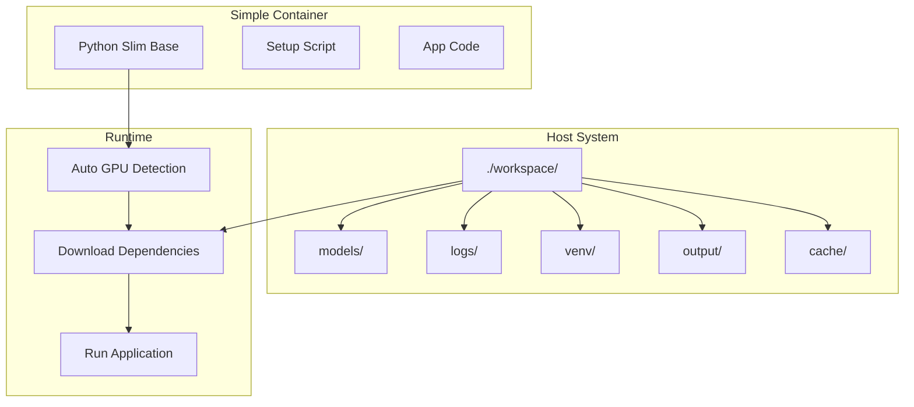

# Design Document

## Overview

This design document outlines a containerized development environment that provides consistency between development and production while using a minimal Docker image approach. The solution employs runtime dependency management, single host directory mounting with container-managed subdirectories, and automatic hardware detection for optimal performance.

The key innovation is shifting from build-time to runtime dependency installation, creating a minimal base image that downloads and caches dependencies on first run, ensuring both small image sizes and fresh dependencies.

## Architecture

The Docker development environment follows a simplified single-container approach:

1. **Minimal Base Image**: Python slim with basic tools only
2. **Single docker-compose.yml**: One file handles everything - no separate dev/prod configs
3. **Runtime Setup**: Container downloads dependencies on first run and caches them
4. **Single Host Mount**: One directory `./workspace` contains all persistent data
5. **Auto-Detection**: Container automatically detects GPU and configures accordingly

### Simplified Architecture



## Components and Interfaces

### 1. Minimal Dockerfile
- **Base**: `python:3.12-slim` (~45MB)
- **Tools**: Only curl and basic tools (~10MB)
- **App Code**: Source code (~5MB)
- **Total**: ~100MB base image

### 2. Simple Setup Script
```bash
#!/bin/bash
# setup.sh - Single script handles everything

# Create directories
mkdir -p /workspace/{models,logs,venv,output,cache}

# Detect GPU
if nvidia-smi &>/dev/null; then
    PYTORCH_INDEX="https://download.pytorch.org/whl/cu121"
else
    PYTORCH_INDEX="https://download.pytorch.org/whl/cpu"
fi

# Setup venv if not exists
if [ ! -d "/workspace/venv" ]; then
    python -m venv /workspace/venv
    source /workspace/venv/bin/activate
    pip install torch --index-url $PYTORCH_INDEX
    pip install -r requirements.txt
fi

# Run app
source /workspace/venv/bin/activate
python -m src.main "$@"
```

### 3. Single docker-compose.yml
```yaml
version: '3.8'
services:
  app:
    build: .
    volumes:
      - ./workspace:/workspace
      - ./src:/app/src:ro
    environment:
      - GEMINI_API_KEY=${GEMINI_API_KEY}
    deploy:
      resources:
        reservations:
          devices:
            - driver: nvidia
              count: all
              capabilities: [gpu]
```

## Data Models

### Simple Configuration
```yaml
# docker-compose.yml - Single file for everything
version: '3.8'
services:
  app:
    build: .
    volumes:
      - ./workspace:/workspace    # Everything goes here
      - ./videos:/videos:ro       # Input videos
    environment:
      - GEMINI_API_KEY=${GEMINI_API_KEY}
    deploy:
      resources:
        reservations:
          devices:
            - driver: nvidia
              count: all
              capabilities: [gpu]
```

### Simple Directory Structure
```
./workspace/                        # Single host mount
├── models/                         # Downloaded ML models
├── logs/                          # All logs
├── venv/                          # Python virtual environment  
├── output/                        # Processed videos
└── cache/                         # Temporary files
```

### Simple Dockerfile
```dockerfile
FROM python:3.12-slim

# Install system deps
RUN apt-get update && apt-get install -y \
    ffmpeg curl && \
    rm -rf /var/lib/apt/lists/*

# Copy app
WORKDIR /app
COPY src/ ./src/
COPY requirements.txt setup.sh ./

# Make setup script executable
RUN chmod +x setup.sh

# Run setup on start
ENTRYPOINT ["./setup.sh"]
```

## Correctness Properties

*A property is a characteristic or behavior that should hold true across all valid executions of a system-essentially, a formal statement about what the system should do. Properties serve as the bridge between human-readable specifications and machine-verifiable correctness guarantees.*
### Property Reflection

Before defining the correctness properties, I analyzed the acceptance criteria to eliminate redundancy:

**Directory Creation Properties**: Requirements 5.1-5.5 all test creation of specific subdirectories. These can be consolidated into a single comprehensive property that tests all required subdirectories are created.

**Environment Consistency Properties**: Requirements 1.1, 1.2, and 1.3 all relate to dev/prod environment consistency but test different aspects (runtime environment, dependencies, behavior). Each provides unique validation value.

**Caching Properties**: Requirements 4.1, 4.2, 4.3, 4.4, and 4.5 all test caching behavior but cover different scenarios (storage, reuse, validation, recovery, sharing). Each addresses a distinct caching concern.

**Hardware Detection Properties**: Requirements 6.1, 6.2, 6.3, and 6.5 test hardware-related functionality but cover different scenarios (GPU config, fallback, dependency selection, consistency). Requirement 6.4 is not testable as it requires external driver updates.

**Logging Properties**: Requirements 7.1-7.5 all test logging and monitoring but each covers different aspects of the logging system.

After reflection, I identified one consolidation opportunity:
- Requirements 5.1-5.5 can be combined into a single comprehensive directory structure property

Each remaining property provides unique validation value for the system.

### Property 1: Development-Production Environment Equivalence
*For any* configuration and runtime environment, when comparing development and production containers, then they should have identical dependency versions, environment variables, and application behavior
**Validates: Requirements 1.1, 1.2, 1.3**

### Property 2: Configuration Runtime Reflection
*For any* configuration change made to environment variables or config files, when the container is running, then the application should reflect the changes without requiring a container rebuild
**Validates: Requirements 1.4**

### Property 3: Environment Validation on Startup
*For any* container startup, when initialization completes, then the system should validate and report that the development environment matches production specifications
**Validates: Requirements 1.5**

### Property 4: Runtime Dependency Download
*For any* container startup with empty cache, when dependencies are not cached, then the system should download Python and system dependencies and cache them for future use
**Validates: Requirements 2.2, 2.3**

### Property 5: Dependency Caching and Reuse
*For any* container restart with existing cache, when cached dependencies are available and valid, then the system should reuse them without re-downloading
**Validates: Requirements 4.1, 4.2**

### Property 6: Cache Integrity and Recovery
*For any* cached dependency, when checking cache integrity, then the system should validate cached items and automatically re-download corrupted dependencies
**Validates: Requirements 4.3, 4.4**

### Property 7: Cache Sharing Between Containers
*For any* multiple container instances using the same host mount, when dependencies are cached, then all containers should share the same cache without conflicts
**Validates: Requirements 4.5**

### Property 8: Complete Directory Structure Creation
*For any* container startup with empty host mount, when initialization runs, then the system should create all required subdirectories (models, logs, venv, output, cache) with proper permissions
**Validates: Requirements 3.1, 3.5, 5.1, 5.2, 5.3, 5.4, 5.5**

### Property 9: Data Organization by Purpose
*For any* file or data generated during container operation, when data is written, then it should be placed in the appropriate subdirectory based on its purpose and type
**Validates: Requirements 3.2, 3.4**

### Property 10: Directory Permissions Management
*For any* subdirectory created by the container, when the directory is accessed, then it should have appropriate permissions for the container user and be writable where required
**Validates: Requirements 3.3**

### Property 11: Hardware-Based Configuration
*For any* hardware environment (CPU-only or GPU-enabled), when the container starts, then the system should automatically detect hardware and configure appropriate acceleration settings
**Validates: Requirements 6.1, 6.2**

### Property 12: Hardware-Specific Dependency Selection
*For any* PyTorch installation, when downloading dependencies, then the system should select CPU or GPU versions based on detected hardware capabilities
**Validates: Requirements 6.3**

### Property 13: Cross-Hardware Behavior Consistency
*For any* application operation, when running on different hardware configurations, then the system should maintain consistent functional behavior regardless of CPU or GPU acceleration
**Validates: Requirements 6.5**

### Property 14: Comprehensive Initialization Logging
*For any* container startup, when initialization proceeds, then the system should log all steps with timestamps, progress indicators, and completion status
**Validates: Requirements 7.1, 7.2, 7.4, 7.5**

### Property 15: Error Handling with Helpful Messages
*For any* error condition during initialization or operation, when errors occur, then the system should provide detailed error messages with suggested solutions
**Validates: Requirements 7.3**

### Property 16: Development Workflow Support
*For any* development activity (code changes, debugging, testing), when working within the container, then the system should support live reloading, interactive debugging, and testing frameworks
**Validates: Requirements 8.1, 8.2, 8.3, 8.4, 8.5**

### Property 17: Dependency Installation Validation
*For any* dependency installation process, when dependencies are downloaded and installed, then the system should validate all dependencies are correctly installed before proceeding with application startup
**Validates: Requirements 2.5**

## Error Handling

### Initialization Errors
- **Network Connectivity**: Graceful handling of network failures during dependency downloads with retry logic
- **Disk Space**: Early detection of insufficient disk space with clear error messages and cleanup suggestions
- **Permission Issues**: Clear feedback for host mount permission problems with suggested fixes
- **Hardware Detection Failures**: Fallback strategies when GPU detection fails

### Runtime Errors
- **Cache Corruption**: Automatic detection and recovery from corrupted cache files
- **Dependency Conflicts**: Clear error messages for version conflicts with resolution suggestions
- **Resource Exhaustion**: Monitoring and alerts for memory/disk usage approaching limits
- **Configuration Errors**: Validation of environment variables and configuration files with helpful error messages

### Recovery Strategies
- **Partial Cache Recovery**: Selective cache cleanup and re-download for corrupted items
- **Graceful Degradation**: Fallback to CPU processing when GPU acceleration fails
- **Automatic Cleanup**: Scheduled cleanup of temporary files and old cache entries
- **State Persistence**: Preservation of working state across container restarts

## Testing Strategy

### Dual Testing Approach

The testing strategy employs both unit testing and property-based testing to ensure comprehensive coverage:

**Unit Testing**:
- Specific examples that demonstrate correct behavior for directory creation, dependency installation, and hardware detection
- Integration points between container components and host system
- Edge cases and error conditions for cache management and hardware fallback
- Docker build and runtime process validation

**Property-Based Testing**:
- Universal properties that should hold across all inputs and configurations
- Container behavior verification across different hardware configurations
- Dependency management across various network conditions and cache states
- Cross-platform compatibility testing

**Property-Based Testing Library**: We will use **Hypothesis** for Python property-based testing, integrated with **pytest** for comprehensive test execution and reporting.

**Test Configuration**: Each property-based test will run a minimum of 100 iterations to ensure statistical confidence in the results across different input combinations and system states.

**Test Tagging**: Each property-based test will be tagged with comments explicitly referencing the correctness property using this format: `**Feature: docker-dev-environment, Property {number}: {property_text}**`

### Container Testing Strategy

1. **Build Testing**: Verify minimal image creation and size constraints across different base configurations
2. **Runtime Testing**: Validate container startup, dependency installation, and directory structure creation
3. **Integration Testing**: Test host mount behavior, cache sharing, and hardware detection
4. **Performance Testing**: Measure startup times, cache hit rates, and dependency download performance
5. **Cross-Platform Testing**: Verify behavior across different host operating systems and hardware configurations
6. **Development Workflow Testing**: Validate live reloading, debugging support, and development tool availability

### Test Environment Requirements

- Docker Engine 20.10+
- Multiple hardware configurations (CPU-only and GPU-enabled systems)
- Network simulation tools for testing offline/limited connectivity scenarios
- Host systems with different operating systems (Linux, macOS, Windows)
- Automated CI/CD pipeline integration with matrix testing across configurations