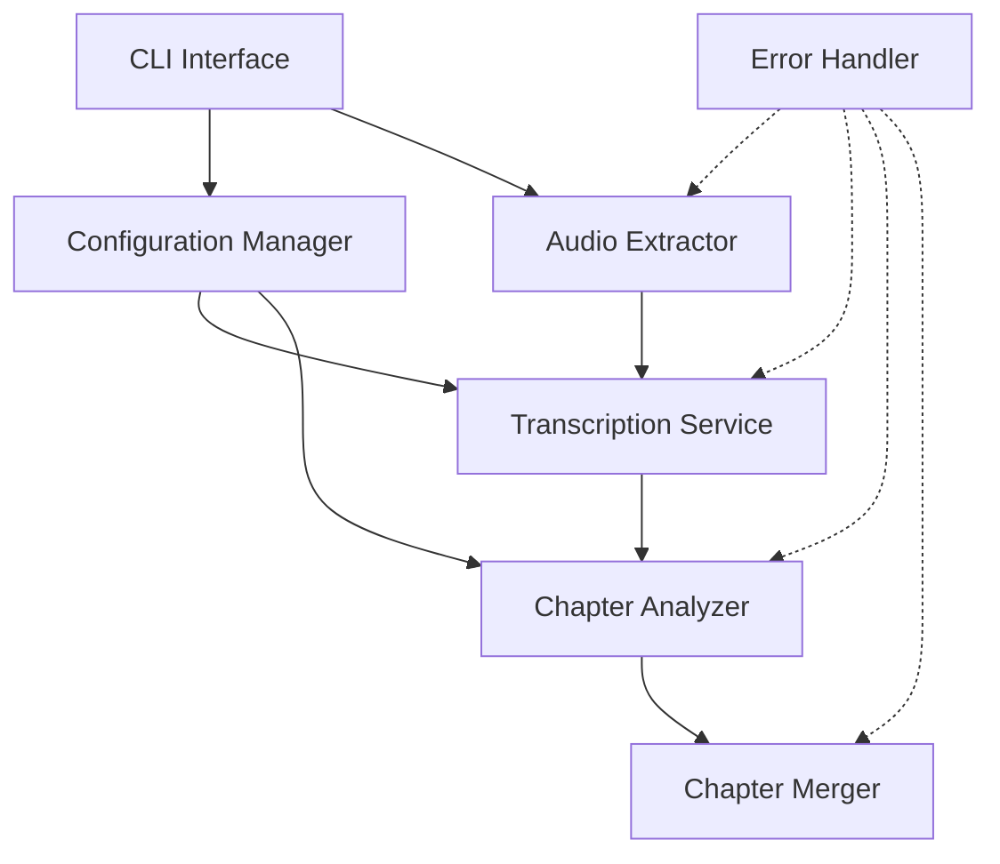

# Design Document

## Overview

The Meeting Video Chapter Tool is a Python-based command-line application that automates the process of adding navigable chapter markers to MKV video files from recorded meetings. The system orchestrates a pipeline of operations: extracting audio via ffmpeg, transcribing with OpenAI's Whisper model, identifying chapter boundaries using Google's Gemini model, and merging chapter metadata back into the video file.

The design emphasizes modularity, clear error handling, and a straightforward pipeline architecture that allows each processing stage to be executed independently or as part of an end-to-end workflow.

## Architecture

The system follows a pipeline architecture with four main processing stages:

```
MKV File → Audio Extraction → Transcription → Chapter Identification → Chapter Merging → Chaptered MKV
```

### High-Level Components

1. **CLI Interface**: Entry point for user interaction, argument parsing, and workflow orchestration
2. **Audio Extractor**: Wraps ffmpeg to extract MP3 audio from MKV files
3. **Transcription Service**: Interfaces with Whisper model for speech-to-text conversion
4. **Chapter Analyzer**: Uses Gemini API to identify logical chapter boundaries from transcripts
5. **Chapter Merger**: Wraps ffmpeg to embed chapter metadata into MKV files
6. **Configuration Manager**: Handles API keys, model settings, and file paths
7. **Error Handler**: Provides consistent error reporting across all components

### Component Interaction Flow



## Components and Interfaces

### CLI Interface

**Responsibilities:**
- Parse command-line arguments
- Orchestrate the processing pipeline
- Display progress and results to the user

**Interface:**
```python
def main(mkv_path: str, output_dir: Optional[str] = None, skip_existing: bool = False) -> int
def run_pipeline(mkv_path: str, config: Config) -> PipelineResult
```

### Audio Extractor

**Responsibilities:**
- Validate MKV file existence and format
- Execute ffmpeg to extract audio track
- Save audio as MP3 file

**Interface:**
```python
class AudioExtractor:
    def extract(self, mkv_path: str, output_path: Optional[str] = None) -> str
    def validate_mkv(self, mkv_path: str) -> bool
```

**Dependencies:** ffmpeg (external binary)

### Transcription Service

**Responsibilities:**
- Load and initialize Whisper model
- Process audio file and generate timestamped transcript
- Save transcript to file

**Interface:**
```python
class TranscriptionService:
    def __init__(self, model_name: str = "openai/whisper-large-v3-turbo")
    def transcribe(self, audio_path: str, output_path: Optional[str] = None) -> Transcript
    def load_model(self) -> None
```

**Dependencies:** transformers library, torch, Whisper model weights

### Chapter Analyzer

**Responsibilities:**
- Format transcript for Gemini API
- Call Gemini to identify chapter boundaries
- Parse and validate chapter data

**Interface:**
```python
class ChapterAnalyzer:
    def __init__(self, api_key: str, model_name: str = "gemini-flash-latest")
    def analyze(self, transcript: Transcript) -> List[Chapter]
    def format_prompt(self, transcript: Transcript) -> str
    def parse_response(self, response: str) -> List[Chapter]
```

**Dependencies:** google-generativeai library

### Chapter Merger

**Responsibilities:**
- Format chapter data for ffmpeg
- Create chapter metadata file
- Execute ffmpeg to merge chapters into MKV

**Interface:**
```python
class ChapterMerger:
    def merge(self, mkv_path: str, chapters: List[Chapter], output_path: Optional[str] = None) -> str
    def create_metadata_file(self, chapters: List[Chapter]) -> str
    def validate_chapters(self, chapters: List[Chapter]) -> bool
```

**Dependencies:** ffmpeg (external binary)

### Configuration Manager

**Responsibilities:**
- Load configuration from .env file and environment variables
- Validate required settings
- Provide configuration to other components

**Interface:**
```python
class Config:
    gemini_api_key: str
    whisper_model: str
    gemini_model: str
    output_dir: str
    skip_existing: bool
    
    @classmethod
    def load(cls, env_file: str = ".env") -> Config
    def validate(self) -> None
```

**Configuration Loading Priority:**
1. Environment variables (highest priority)
2. .env file in current directory
3. Default values (lowest priority)

**Dependencies:** python-dotenv library

## Data Models

### Transcript

```python
@dataclass
class TranscriptSegment:
    start_time: float  # seconds
    end_time: float    # seconds
    text: str

@dataclass
class Transcript:
    segments: List[TranscriptSegment]
    full_text: str
    duration: float
    
    def to_file(self, path: str) -> None
    @classmethod
    def from_file(cls, path: str) -> Transcript
```

### Chapter

```python
@dataclass
class Chapter:
    timestamp: float  # seconds from start
    title: str
    
    def to_ffmpeg_format(self) -> str
    def validate(self) -> bool
```

### PipelineResult

```python
@dataclass
class PipelineResult:
    success: bool
    output_mkv: Optional[str]
    audio_file: Optional[str]
    transcript_file: Optional[str]
    chapters: Optional[List[Chapter]]
    error: Optional[str]
```

## Correctness Properties

*A property is a characteristic or behavior that should hold true across all valid executions of a system—essentially, a formal statement about what the system should do. Properties serve as the bridge between human-readable specifications and machine-verifiable correctness guarantees.*


### Property Reflection

Before defining the final properties, let's identify and eliminate redundancy:

**Redundancies identified:**
- Properties 1.2 and 7.4 both test file output location behavior - can be combined into a general "output location" property
- Properties 1.5 and 4.5 both test that original files remain unchanged on failure - can be combined into a single "file preservation" property
- Properties 6.2 and 6.3 both test error message content - can be combined into a comprehensive "error context" property
- Edge cases (1.3, 1.4, 2.3, 2.5, 3.3, 4.3, 4.4) will be handled by property test generators rather than separate properties

**Consolidated approach:**
- Combine file location properties into one comprehensive property
- Combine file preservation properties into one property
- Combine error message content properties into one property
- Use property test generators to cover edge cases systematically

### Correctness Properties

Property 1: Audio extraction produces valid MP3 files
*For any* valid MKV file with an audio track, extracting audio should produce an MP3 file that contains audio data and can be read by audio processing tools
**Validates: Requirements 1.1**

Property 2: Output files are saved to configured locations
*For any* processing step that generates output files, the files should be saved to the directory specified in configuration (or the source file directory by default)
**Validates: Requirements 1.2, 7.4**

Property 3: Original files remain unchanged on failure
*For any* processing operation that fails (audio extraction or chapter merging), the original input file should remain byte-for-byte identical to its state before the operation
**Validates: Requirements 1.5, 4.5**

Property 4: Transcription produces timestamped output
*For any* valid audio file that is successfully transcribed, the output transcript should contain segments with start times, end times, and text content
**Validates: Requirements 2.2**

Property 5: Chapter lists have valid structure
*For any* generated chapter list, each chapter should have a non-negative timestamp, a non-empty title, and all timestamps should be unique and in ascending order
**Validates: Requirements 3.2, 3.5**

Property 6: Chapter merging embeds metadata in output
*For any* valid MKV file and valid chapter list, merging should produce a new MKV file that contains chapter metadata readable by video players
**Validates: Requirements 4.2**

Property 7: Pipeline executes steps in correct sequence
*For any* end-to-end pipeline execution, the steps should be executed in order (audio extraction → transcription → chapter identification → chapter merging), and each step should receive the output from the previous step
**Validates: Requirements 5.1**

Property 8: Failed steps halt pipeline and report location
*For any* pipeline execution where a step fails, processing should halt immediately, no subsequent steps should execute, and the error should identify which step failed
**Validates: Requirements 5.2**

Property 9: Successful pipeline produces chaptered video
*For any* valid MKV input file, if all pipeline steps complete successfully, the final output should be an MKV file with embedded chapters that can be navigated in video players
**Validates: Requirements 5.3**

Property 10: Pipeline reports all generated file locations
*For any* pipeline execution that completes (successfully or with errors), the output should include the file paths of all successfully generated intermediate and final files
**Validates: Requirements 5.4**

Property 11: Skip existing files option prevents regeneration
*For any* pipeline execution with skip_existing enabled, if an intermediate file already exists and is valid, that processing step should be skipped and the existing file should be used
**Validates: Requirements 5.5**

Property 12: Error messages include relevant context
*For any* error that occurs during processing, the error message should include contextual information such as the dependency name (for external tool failures) or file path (for file operation failures)
**Validates: Requirements 6.2, 6.3**

Property 13: Warnings are displayed to user
*For any* pipeline execution that completes with warnings, all warning messages should be included in the output displayed to the user
**Validates: Requirements 6.5**

Property 14: Configuration loads from expected sources
*For any* system startup, configuration should be loaded from .env file and environment variables, with environment variables taking precedence over .env file values
**Validates: Requirements 7.1**

Property 15: Missing required configuration is reported
*For any* configuration state where required API keys are missing, the system should report which specific keys are missing and halt before attempting any API calls
**Validates: Requirements 7.2**

Property 16: Custom configuration overrides defaults
*For any* configuration where custom model names or settings are provided, those custom values should be used instead of default values during processing
**Validates: Requirements 7.3**

Property 17: Invalid configuration is rejected early
*For any* invalid configuration (malformed paths, invalid model names, etc.), validation errors should be reported before any processing begins
**Validates: Requirements 7.5**

## Error Handling

### Error Categories

1. **File System Errors**
   - Missing input files
   - Permission denied
   - Disk space issues
   - Invalid file formats

2. **External Dependency Errors**
   - ffmpeg not found or execution failure
   - Whisper model loading failure
   - Gemini API errors (network, authentication, rate limits)

3. **Data Validation Errors**
   - Empty or malformed transcripts
   - Invalid chapter data
   - Configuration validation failures

4. **Processing Errors**
   - Audio extraction failures
   - Transcription failures
   - Chapter identification failures
   - Chapter merging failures

### Error Handling Strategy

**Fail Fast Principle:**
- Validate inputs before processing
- Check dependencies at startup
- Halt pipeline on first error

**Error Context:**
- Include operation name
- Include relevant file paths
- Include dependency names for external tools
- Include original error messages from external tools

**Error Recovery:**
- Preserve original files on failure
- Clean up partial outputs on failure
- Provide clear guidance for resolution

**Example Error Messages:**
```
Error: Audio extraction failed
  File: /path/to/meeting.mkv
  Tool: ffmpeg
  Cause: No audio track found in video file
  
Error: Transcription failed
  File: /path/to/audio.mp3
  Model: openai/whisper-large-v3-turbo
  Cause: Failed to load model weights
  
Error: Configuration invalid
  Missing required API key: GEMINI_API_KEY
  Set via environment variable or config file
```

## Testing Strategy

### Unit Testing

The system will use pytest for unit testing. Unit tests will focus on:

1. **Component Isolation**: Test each component independently with mocked dependencies
2. **Edge Cases**: Empty files, missing files, malformed data
3. **Error Conditions**: Verify proper error handling and messages
4. **Configuration**: Test configuration loading and validation logic
5. **Data Models**: Test serialization/deserialization of transcripts and chapters

Example unit test areas:
- AudioExtractor with mocked ffmpeg calls
- ChapterAnalyzer with mocked Gemini API responses
- Configuration validation with various invalid inputs
- Chapter data validation and formatting

### Property-Based Testing

The system will use Hypothesis for property-based testing in Python. Property tests will verify universal properties across many randomly generated inputs.

**Configuration:**
- Each property test will run a minimum of 100 iterations
- Tests will use custom generators for domain-specific data (file paths, timestamps, chapter lists)

**Property Test Implementation:**
- Each property test MUST be tagged with a comment referencing the design document
- Tag format: `# Feature: meeting-video-chapters, Property {number}: {property_text}`
- Each correctness property will be implemented by a SINGLE property-based test

**Test Generators:**

Custom Hypothesis strategies will be created for:
- Valid and invalid file paths
- MKV files with various audio configurations
- Transcript data with various segment structures
- Chapter lists with valid and invalid timestamps
- Configuration objects with various settings

**Edge Case Coverage:**

Property test generators will systematically cover edge cases:
- Empty files and empty data structures
- Missing files and invalid paths
- Files without audio tracks
- Silent or very short audio
- Empty transcripts
- Invalid chapter timestamps (negative, out of order, duplicates)
- Missing API keys
- Invalid configuration values

**Example Property Tests:**

```python
@given(valid_mkv_path=mkv_files(), config=valid_configs())
def test_audio_extraction_produces_valid_mp3(valid_mkv_path, config):
    # Feature: meeting-video-chapters, Property 1: Audio extraction produces valid MP3 files
    extractor = AudioExtractor()
    output_path = extractor.extract(valid_mkv_path)
    assert os.path.exists(output_path)
    assert output_path.endswith('.mp3')
    assert is_valid_audio_file(output_path)

@given(chapters=chapter_lists())
def test_chapter_structure_validity(chapters):
    # Feature: meeting-video-chapters, Property 5: Chapter lists have valid structure
    for chapter in chapters:
        assert chapter.timestamp >= 0
        assert len(chapter.title) > 0
    timestamps = [c.timestamp for c in chapters]
    assert timestamps == sorted(timestamps)
    assert len(timestamps) == len(set(timestamps))
```

### Integration Testing

Integration tests will verify the end-to-end pipeline with real (but small) test fixtures:
- Small test MKV files with known content
- Verify complete pipeline execution
- Verify intermediate file generation
- Verify final output contains chapters

### Manual Testing Checklist

Before release, manually verify:
- [ ] ffmpeg is correctly invoked for audio extraction
- [ ] Whisper model loads and transcribes sample audio
- [ ] Gemini API returns reasonable chapter suggestions
- [ ] ffmpeg correctly embeds chapters in output MKV
- [ ] Video players (VLC, mpv) can navigate chapters
- [ ] Error messages are clear and actionable
- [ ] Configuration from .env file works correctly
- [ ] Environment variables override .env file values
- [ ] Skip existing files option works correctly

### .env File Example

```env
# Gemini API Configuration
GEMINI_API_KEY=your_api_key_here
GEMINI_MODEL=gemini-flash-latest

# Whisper Model Configuration
WHISPER_MODEL=openai/whisper-large-v3-turbo

# Output Configuration
OUTPUT_DIR=./output
SKIP_EXISTING=false
```

## Implementation Notes

### External Dependencies

**ffmpeg:**
- Must be installed and available in system PATH
- Version 4.0 or higher recommended
- Used for audio extraction and chapter merging

**Python Libraries:**
- transformers: For Whisper model
- torch: Required by transformers
- google-generativeai: For Gemini API
- python-dotenv: For .env file support
- hypothesis: For property-based testing
- pytest: For unit testing

### Whisper Model Considerations

- Model will be downloaded on first use (~1.5GB)
- Consider caching model location
- GPU acceleration optional but recommended for speed
- Model runs locally (no API calls)

### Gemini API Considerations

- Requires API key from Google AI Studio
- Rate limits apply (check current quotas)
- Network connectivity required
- Consider retry logic for transient failures

### Chapter Format

ffmpeg expects chapter metadata in this format:
```
;FFMETADATA1
[CHAPTER]
TIMEBASE=1/1000
START=0
END=300000
title=Introduction

[CHAPTER]
TIMEBASE=1/1000
START=300000
END=600000
title=Main Discussion
```

### Performance Considerations

- Whisper transcription is the slowest step (depends on audio length)
- Consider progress indicators for long-running operations
- Gemini API calls are typically fast (<5 seconds)
- ffmpeg operations are fast (seconds for typical meeting videos)

### Future Enhancements

Potential improvements not in current scope:
- Batch processing multiple files
- GUI interface
- Chapter editing/refinement
- Support for other video formats
- Alternative transcription services
- Chapter export to various formats
